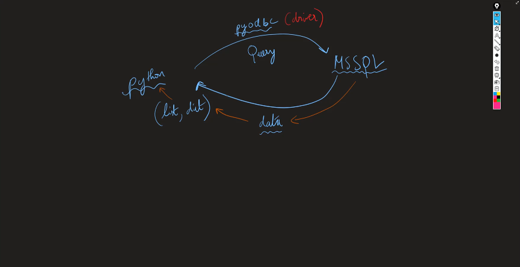

# Day-12 🚀

# Python Day-5 📆

# Error handling (Advanced)

We know how to raise a particular built-in error when specific scenario arises. 

For example, let’s say there’s a function `calculate_age()` which gets year of birth from the user and calculates the age accordingly. If we try to error handle this function we need to know what are all the possible scenarios that might error out.

There are three such possible scenarios.

1. If the user gives a `str` instead of `int` for `year` 
2. If the user gives a future year as `year` 
3. If the user gives a negative number as `year` 

let’s handle this one-by-one

### Scenario 1: If the user gives a `str` instead of `int` for `year`

```python
from datetime import datetime
# Calculate age & Handle errors
def calculate_age():
    birth_year = input("Please provide your birth year: ")
    try:
        birth_year = int(birth_year)
        age = datetime.now().year - birth_year
        print(f'Your age is {age}')
    except ValueError:
        print(f"Invalid Argument: Year cannot be a String ❌")
  
    finally:   
        return f"Operation Done 🫡"

print(calculate_age())
```

Here if the line `birth_year = int(birth_year)` produces `ValueError` , then we’re handling it in the except block

### Scenario 2: If the user gives a future year as `year`

```python
from datetime import datetime
# Calculate age & Handle errors
def calculate_age():
    birth_year = input("Please provide your birth year: ")
    try:
        birth_year = int(birth_year)
        if birth_year > datetime.now().year:
            raise Exception(" Strictly, no one from future ⚠️")
        age = datetime.now().year - birth_year
        print(f'Your age is {age}')

    except ValueError:
        print(f"Invalid Argument: Year cannot be a String ❌")
    except Exception as e:
        print(f"Invalid Argument: {e}")
    finally:   
        return f"Operation Done 🫡"

print(calculate_age())
```

Here if the line `if birth_year > datetime.now().year:` goes true, then it raises `Exception` , which we’re handling it in the second except block

### Scenario 3: If the user gives a negative number as `year`

```python
from datetime import datetime
# Calculate age & Handle errors
def calculate_age():
    birth_year = input("Please provide your birth year: ")
    try:
        birth_year = int(birth_year)
        if birth_year > datetime.now().year:
            raise Exception(" Strictly, no one from future ⚠️")
        if birth_year < 0:
            raise Exception(" You are existing even before the Big Bang 😲")
        age = datetime.now().year - birth_year
        print(f'Your age is {age}')

    except ValueError:
        print(f"Invalid Argument: Year cannot be a String ❌")
    except Exception as e:
        print(f"Invalid Argument: {e}")
    finally:   
        return f"Operation Done 🫡"

print(calculate_age())
```

Here if the line `if birth_year < 0:` goes true, then it raises `Exception` , which we’re handling it in the second except block.

So in this particular problem all the erroring scenarios are well handled with exception classes and Error classes in python. What if there arises a error which is very specific to our application. Then we need to create our own error classes. Let’s see how to do that. 

### Points to Remember:

All Errors are having `Exceptions` as base classes

Think of a function `only_positive()`  which accepts only positive numbers. If a negative number is given then it has to raise a error

```python
def only_positive(x):
	if x < 0:
			# Handle Exception Here
```

In this scenario we need to error out and say, No negative number is allowed. Let’s say we want to built this Error class by ourselves

Let’s create it

```python
class NegativeNumberError(Exception):
		def __init__(self.value):
					self.value = value
					self.message = "No negative numbers are allowed"
					super().__init__(self.message)
		
		def __str__(self):
					return f"{self.value} → {self.message}"
```

Now that we have created the Exception classes, let’s use it in our program

```python
def only_positive(x):
	try:	
		if x < 0:
				raise NegativeNumberError(x)
	except NegativeNumberError as err:
			print(err)
	else:
			print(x)
	
```

# Project setup

- Start by creating a new folder for the project and open it in the VSCode
- Write a `main.py` file for testing it. Maybe `print(”Hello World!”)`
- Now Open terminal. (Shortcut `ctrl` + `shift` + ```
- Ensure it is in powershell. Or open it in powershell manually
- Type the following command to create a new virtual environment
    
    ```powershell
    python -m venv myenv 
    ```
    
- Once it is created click on yes button for the prompt asking to add the virtual interpreter to the workspace  folder
- Now, activate the scripts
    
    ```powershell
    \myenv\Scripts\Activate.ps1
    ```
    
- Now add a `.gitignore` file to ignore the myenv folder
- Now create the  repository

Connect DB

CRUD ops

Organising Project

# Connecting Databases to Python

Firstly, we need a driver for connecting to databases. Why do we need a driver  in the first place?



**ODBC** is what we need. ODBC is a standard for drivers for SQLs. In python we have PyODBC

### Steps for installing PyODBC

1. Go to powershell terminal in IDE
2. Make sure it is activated using the script command
    
    ```powershell
    myenv\Scripts\Activate.ps1
    ```
    
3. Type in the following command
    
    ```powershell
    pip install pyodbc
    ```
    

Wait for the installation to complete. There you have it.

### Establishing Connection with Database

1. Go to your connection module, and make the connection string. Here’s a general syntax.

    
    ```python
    server_name = "YOUR SERVER NAME HERE"
    database_name = "YOUR DATABASE HERE"
     
     
    conn_str = (
        f"Driver={{SQL Server}};" #Be sure  to check the curly braces here
        f"Server={server_name};"
        f"Database={database_name};"
        f"Trusted_Connection=yes;"
    )
    ```
    
2. After  constructing the Connection string you can establish connection by using `connect()` method.
    
    ```python
    conn = pyodbc.connect(conn_str)
    cursor = conn.cursor()
    ```
    
3. Now that we have established a connection, and created a cursor let’s test the connection
    
    ```python
    cursor.execute("Select 1")
    ```
    
    functions which are talking to our database is called services. In otherwords, layer that interacts with database
    
4. Now, let’s see how we can write queries and execute them in `PyODBC` 
    - First we need to write a query string which is a normal string that has SQL queries
    
    ```python
    query = "SELECT * FROM [customer]"
    ```
    
    - Next step, we need to get a cursor object from the connection object through which we’re going to execute the queries
    
    ```python
    cursor =  conn.cursor()
    cursor.execute(query)
    ```
    
    - Once the query is executed the result is stored in cursor. We can fetch it with the help of `fetchone()` or `fetchall()` methods
    
    ```python
    result = cursor.fetchall()
    ```
    
5. Now for the next big upgrade let’s execute dynamic queries.
    - Suppose we want to fetch customeer details by specifiying a customer id. That particular customer id is going to be given by user.
    - Let’s consider we have got the input  from the user in a variable called, `id`
    - We can execute the dynamic query by, passing the `query` string and also tuple containing `id` or any other dynamic fields.
    - Let’s see how to do  this
    
    ```python
    query = "SELECT * FROM [customer] WHERE [customerid] = ?"
    values = ( id ) #Tuple containing values
    
    cursor.execute(query, values)
    ```
    
    Thus we have executed the dynamic query