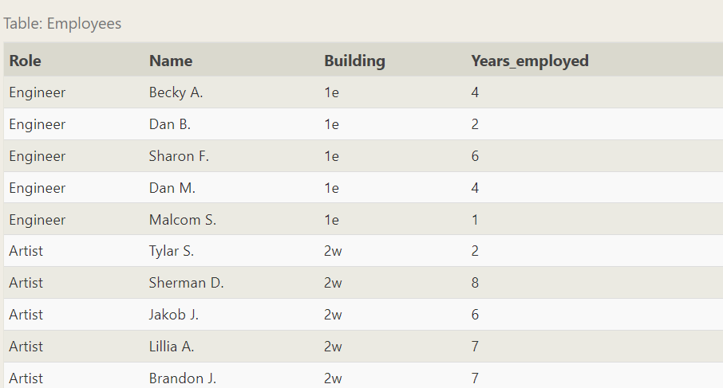

# Day-4 🚀

# SQL Day-2: 📆

## Agenda

- Group By
- Aggregation
- DDL commands
- SSMS Intorduction
- Sub queries
- ER Diagrams

Case Study & Project are Same - Teams - Individual

---

Assignments - Individual

---

Coding Challenge - Exam & Viva

---

## **SQL Lesson 10: Queries with aggregates (Pt. 1)**

In addition to simple expression SQL also supports the use of Aggregate expression.

Aggregate expressions allows us to summarize the data by grouping a set of records.

Syntax,

```sql
SELECT AGG_FUNC(column_or_expression) AS aggregate_description, …
FROM mytable
WHERE constraint_expression;
```

### Some Common Aggregation functions are,

| Function | Description |
| --- | --- |
| COUNT(*), COUNT(column) | A common function used to counts the number of rows in the group if no column name is specified. Otherwise, count the number of rows in the group with non-NULL values in the specified column. |
| MIN(column) | Finds the smallest numerical value in the specified column for all rows in the group. |
| MAX(column) | Finds the largest numerical value in the specified column for all rows in the group. |
| AVG(column) | Finds the average numerical value in the specified column for all rows in the group. |
| SUM(column) | Finds the sum of all numerical values in the specified column for the rows in the group. |

As said, Aggregate function mostly used along side with grouping to provide meaningful insights

```sql
SELECT AGG_FUNC(column_or_expression) AS aggregate_description, …
FROM mytable
WHERE constraint_expression
GROUP BY column;
```



Exercise 10 — Tasks

Task 1: Find the longest time that an employee has been at the studio ✓

```sql
SELECT MAX(Years_employed) AS Longest_Time_Employed FROM employees;
```

Task 2: For each role, find the average number of years employed by employees in that role

```sql
SELECT Role, AVG(Years_employed) AS Average_Years 
FROM employees
GROUP BY Role;
```

Task 3: Find the total number of employee years worked in each building

```sql
SELECT Building, SUM(Years_employed) AS Total_Years 
FROM employees
GROUP BY Building;
```

## **SQL Lesson 11: Queries with aggregates (Pt. 2)**

As we progress with `SELECT` statement, we might notice that we can not apply `WHERE` clause after `GROUP BY` but can be applied before it. In situation where, the `WHERE` clause is to be applied after `GROUP BY`  we can make use of `HAVING`  clause.

```sql
SELECT group_by_column, AGG_FUNC(column_expression) AS aggregate_result_alias, …
FROM mytable
WHERE condition
GROUP BY column
HAVING group_condition;
```

Note: If you aren't using the `GROUP BY` clause, a simple `WHERE` clause will suffice.


Exercise 11 — Tasks

Task 1: Find the number of Artists in the studio (without a **HAVING** clause) ✓

```sql
SELECT COUNT(Role) 
FROM employees
WHERE Role="Artist"

--Using HAVING clause
SELECT COUNT(Role) 
FROM employees
GROUP BY Role
HAVING Role="Artist"
```

Task 2: Find the number of Employees of each role in the studio

```sql
SELECT Role, COUNT(Role) 
FROM employees
GROUP BY Role
```

Task 3: Find the total number of years employed by all Engineers

```sql
--Using HAVING
SELECT SUM(Years_Employed)
FROM employees
GROUP BY Role
HAVING Role="Engineer";

--Using WHERE clause
SELECT SUM(Years_Employed)
FROM employees
WHERE Role="Engineer";
```

## **SQL Lesson 12: Order of execution of a Query**

Now that we have learnt all parts of query, it is time to know about the order of execution of the  queries to get a good understanding of the queries

```sql
SELECT DISTINCT column, AGG_FUNC(column_or_expression), …
FROM mytable
    JOIN another_table
      ON mytable.column = another_table.column
    WHERE constraint_expression
    GROUP BY column
    HAVING constraint_expression
    ORDER BY column ASC/DESC
    LIMIT count OFFSET COUNT;
```

1. `FROM` ’s and `JOIN` ’s
    
    `FROM` ’s and `JOIN` ’s are the first part of the  query to be get executed to determine  the amount of data the query is to be worked on. 
    
2. `WHERE` ’s
    
    It is the `WHERE` clauses that defines what are all the records that has to be displayed.
    
3. `GROUP BY` ’s
    
    After finding the appropriate records now it is all upto organizing the records. This is clause in used to organise the fetched records by comman values of a attribute.
    
    For example, grouping students age wise.
    
4. `HAVING` ’s
    
    After grouping we might need to still filter some groups. In this situation as discussed before the `WHERE` clause is not going to work. So we have to make use of `HAVING` clause.
    
    For example, grouping students agewise who are all having age greater than 16
    
5. `SELECT` ’s
    
    This part of the query  makes the fetched record ready for presentation.
    
6. `DISTINCT` ’s
    
    To display only distinct records. no repetitions
    
7. `ORDER BY` ’s
    
    To order the fetched records with accordance to particular attribute either in Ascending or descending
    
8. `LIMIT` / `OFFSET` ’s
    
    To specify how many records to be displayed  in the output and  from where to display the output
    

Exercise 12 — Tasks

Task 1: Find the number of movies each director has directed ✓

```sql
SELECT COUNT(Title), Director 
FROM movies
GROUP BY Director;
```

Task 2: Find the total domestic and international sales that can be attributed to each directo

```sql
SELECT Director, SUM((Domestic_sales + International_sales)) as Gross_sales 
FROM movies
LEFT JOIN Boxoffice
ON id = movie_id
GROUP BY Director;
```

## **SQL Lesson 13: Inserting rows**

In SQL the tables are two dimensional structures with rows and columns. The *database schemas* is what describes the structure of the table, and the datatypes that each column of the table  can contain.

### Inserting New Data:

For inserting  data into a table we need to make use of `INSERT` statement. which specifies the  table upon which insertion is performed. After that, we need to specify the values to be inserted using `VALUES()` in which the actual values are specified inside the parantheses.

```sql
INSERT INTO mytable
VALUES (value_or_expr, another_value_or_expr, …),
       (value_or_expr_2, another_value_or_expr_2, …),
       …;
```

In some cases, if you have incomplete data and the table contains columns that support default values, you can insert rows with only the columns of data you have by specifying them explicitly.

```sql
INSERT INTO mytable
(column, another_column, …)
VALUES (value_or_expr, another_value_or_expr, …),
      (value_or_expr_2, another_value_or_expr_2, …),
      …;
```


Exercise 13 — Tasks

Task 1: Add the studio's new production, **Toy Story 4** to the list of movies (you can use any director)

```sql
INSERT INTO MOVIES VALUES(4,"Toy Story 4", "Sugapriyan", 2077, 120)
```

Task 2: Toy Story 4 has been released to critical acclaim! It had a rating of **8.7**, and made **340 million domestically** and **270 million internationally**. Add the record to the **`BoxOffice`** table.

```sql
INSERT INTO Boxoffice VALUES(4,8.7,340000000,270000000)
```

## **SQL Lesson 14: Updating rows**

In addition to add new data, a common task is to update an existing data which can be done using `UPDATE` statement

```sql
UPDATE mytable
SET column = value_or_expr, 
    other_column = another_value_or_expr, 
    …
WHERE condition;
```

One helpful tip is to always write the constraint first and test it in a **`SELECT`** query to make sure you are updating the right rows, and only then writing the column/value pairs to update.


Exercise 14 — Tasks

Task 1: The director for A Bug's Life is incorrect, it was actually directed by **John Lasseter**

```sql
UPDATE movies
SET Director="John Lasseter"
WHERE id = 2
```

Task 2: The year that Toy Story 2 was released is incorrect, it was actually released in **1999**

```sql
UPDATE movies
SET Year = "1999"
WHERE id = 3
```

Task 3: Both the title and director for Toy Story 8 is incorrect! The title should be "Toy Story 3" and it was directed by **Lee Unkrich**

```sql
UPDATE movies
SET Title = "Toy Story 3", Director  = "Lee Unkrich"
WHERE id = 11
```

## **SQL Lesson 15: Deleting rows**

When you need to delete data from a table in the database, you can use a **`DELETE`** statement, which describes the table to act on, and the rows of the table to delete through the **`WHERE`** clause.

```
DELETE FROM mytable
WHERE condition;
```

If you decide to leave out the **`WHERE`** constraint, then *all* rows are removed, which is a quick and easy way to clear out a table completely


Exercise 15 — Tasks

Task 1: This database is getting too big, lets remove all movies that were released **before** 2005.

```sql
DELETE FROM movies
WHERE year < 2005
```

Task 2: Andrew Stanton has also left the studio, so please remove all movies directed by him.

```sql
DELETE FROM movies
WHERE Director = "Andrew Stanton"
```

# DDL Commands

DDL commands are those that are used to create a table, update a table, defining a table structure, Dropping the table and so on.

## **SQL Lesson 16: Creating tables**

When you have new entities and relationships to store in your database, you can create a new database table using the **`CREATE TABLE`** statement.

Create table statement w/ optional table constraint and default value

```sql
CREATE TABLE IF NOT EXISTS mytable (
    column DataType TableConstraint DEFAULT default_value,
    another_column DataType TableConstraint DEFAULT default_value,
    …
);
```

The structure of the new table is defined by its *table schema*, which defines a series of columns. Each column has a name, the type of data allowed in that column, an *optional* table constraint on values being inserted, and an optional default value.

If there already exists a table with the same name, the SQL implementation will usually throw an error, so to suppress the error and skip creating a table if one exists, you can use the **`IF NOT EXISTS`** clause.

## Table Datatypes

| Data type | Description |
| --- | --- |
| INTEGER, BOOLEAN | The integer datatypes can store whole integer values like the count of a number or an age. In some implementations, the boolean value is just represented as an integer value of just 0 or 1. |
| FLOAT, DOUBLE, REAL | The floating point datatypes can store more precise numerical data like measurements or fractional values. Different types can be used depending on the floating point precision required for that value. |
| CHARACTER(num_chars), VARCHAR(num_chars), TEXT | The text based datatypes can store strings and text in all sorts of locales. The distinction between the various types generally amount to underlaying efficiency of the database when working with these columns.
Both the CHARACTER and VARCHAR (variable character) types are specified with the max number of characters that they can store (longer values may be truncated), so can be more efficient to store and query with big tables. |
| DATE, DATETIME | SQL can also store date and time stamps to keep track of time series and event data. They can be tricky to work with especially when manipulating data across timezones. |
| BLOB | Finally, SQL can store binary data in blobs right in the database. These values are often opaque to the database, so you usually have to store them with the right metadata to requery them. |

`FLOAT` can hold 3 digits

`DOUBLE` can hold 6 digits

`REAL` can hold 12 digits

### Table constraints

| Constraint | Description |
| --- | --- |
| PRIMARY KEY | This means that the values in this column are unique, and each value can be used to identify a single row in this table. |
| AUTOINCREMENT | For integer values, this means that the value is automatically filled in and incremented with each row insertion. Not supported in all databases. |
| UNIQUE | This means that the values in this column have to be unique, so you can't insert another row with the same value in this column as another row in the table. Differs from the `PRIMARY KEY` in that it doesn't have to be a key for a row in the table. |
| NOT NULL | This means that the inserted value can not be `NULL`. |
| CHECK (expression) | This allows you to run a more complex expression to test whether the values inserted are valid. For example, you can check that values are positive, or greater than a specific size, or start with a certain prefix, etc. |
| FOREIGN KEY | This is a consistency check which ensures that each value in this column corresponds to another value in a column in another table.For example, if there are two tables, one listing all Employees by ID, and another listing their payroll information, the `FOREIGN KEY` can ensure that every row in the payroll table corresponds to a valid employee in the master Employee list. |

Here's an example schema for the ***Movies*** table that we've been using in the lessons up to now.

Movies table schema

```sql
CREATE TABLE movies (
    id INTEGER PRIMARY KEY,
    title TEXT,
    director TEXT,
    year INTEGER,
    length_minutes INTEGER
);
```

Exercise 16 — Tasks

1. Create a new table named **`Database`** with the following columns:This table has no constraints.
    
    – **`Name`** A string (text) describing the name of the database
    
    – **`Version`** A number (floating point) of the latest version of this database
    
    – **`Download_count`** An integer count of the number of times this database was downloaded
    
    ```sql
    CREATE TABLE IF NOT EXISTS Database(
        Name TEXT,
        Version FLOAT,
        Download_Count INTEGER
    )
    ```
    
    ## **SQL Lesson 17: Altering tables**
    
    As your data changes over time, SQL provides a way for you to update your corresponding tables and database schemas by using the **`ALTER TABLE`** statement to add, remove, or modify columns and table constraints.
    
    ### **Adding columns**
    
    ```sql
    ALTER TABLE mytable
    ADD column DataType OptionalTableConstraint 
        DEFAULT default_value;
    ```
    
    In some databases like MySQL, you can even specify where to insert the new column using the **`FIRST`** or **`AFTER`** clauses, though this is not a standard feature.
    
    ### **Removing columns**
    
    Dropping columns is as easy as specifying the column to drop, however, some databases (including SQLite) don't support this feature. Instead you may have to create a new table and migrate the data over.
    
    ```sql
    ALTER TABLE mytable
    DROP column_to_be_deleted;
    ```
    
    # Renaming the table
    
    If you need to rename the table itself, you can also do that using the **`RENAME TO`** clause of the statement.
    
    ```sql
    ALTER TABLE mytable
    RENAME TO new_table_name;
    ```
    
    
    
    Exercise 17 — Tasks
    
    Task 1: Add a column named **Aspect_ratio** with a **FLOAT** data type to store the aspect-ratio each movie was released in.
    
    ```sql
    ALTER TABLE Movies
    ADD column Aspect_ratio FLOAT
    ```
    
    Task 2: Add another column named **Language** with a **TEXT** data type to store the language that the movie was released in. Ensure that the default for this language is **English**.
    
    ```sql
    ALTER TABLE Movies
    ADD column Language Text
        DEFAULT "English"
    ```
    
    ## **SQL Lesson 18: Dropping tables**
    
    In some rare cases, you may want to remove an entire table including all of its data and metadata, and to do so, you can use the **`DROP TABLE`** statement, which differs from the **`DELETE`** statement
    
    ```sql
    DROP TABLE IF EXISTS mytable;
    ```
    
    In addition, if you have another table that is dependent on columns in table you are removing (for example, with a **`FOREIGN KEY`** dependency) then you will have to either update all dependent tables first to remove the dependent rows or to remove those tables entirely.
    
    Exercise 18 — Tasks
    
    Task 1: We've sadly reached the end of our lessons, lets clean up by removing the **Movies** table
    
    ```sql
    DROP TABLE IF EXISTS Movies
    ```
    
    Task 2: And drop the **BoxOffice** table as well
    
    ```sql
    DROP TABLE IF EXISTS Boxoffice
    ```
    
    # SSMS Introduction
    
    ## Setting Up SSMS
    
    
    
    - Click on the “Server name” dropdown and select the appropriate server.
        - For users who are using local machines as their database, click on <Browse-for-More>.
        - Then Click on Database Engines.
        - Then click on your PC-Name
    - Now set the “Authentication”  field to “Windows Authentication”
    - Now click “connect”
    
    ***Note:** There might be warning showing certificate not trusted for users who are all using local machine as their database. Click on **“Yes”***
    
    ## Creating Database in SSMS
    
    After setting  up SSMS, now its time to explore and find how to create database and start querying
    
    
    
    - On the right side, you’ll see **Object Explorer**
    - In Object Explorer, there is a directory  **“📁Database”.** Right-click on the directory to bring up context menu.
    - In the menu click **“New Database”** Option which will bring up the new database wizard.
    
    
    
    - In this window, give your Database a name in **“Database Name”** input field.
    - Then click “**OK”**
    
    ## Querying Databases
    
    Now that we havee created databases, it’s time to query and make our database speak.
    
    
    
    - In the **“Object Explorer”, below “**📁**Directory”** you can see the database created listed.
    - Right-click on the database to bring-up context menu. Now click **“New Query”** option. This opens the query tab for our database.
    
    ## Tasks on SSMS
    
    Creating a Salesman Database:
    
    ```sql
    CREATE TABLE salesman (
        salesman_id INT PRIMARY KEY,
        name VARCHAR(255),
        city VARCHAR(255),
        commission DECIMAL(4, 2)
    );
    ```
    
    Inserting Values into the salesman Database
    
    ```sql
    INSERT INTO salesman (salesman_id, name, city, commission) VALUES
    (5001, 'James Hoog', 'New York', 0.15),
    (5002, 'Nail Knite', 'Paris', 0.13),
    (5005, 'Pit Alex', 'London', 0.11),
    (5006, 'Mc Lyon', 'Paris', 0.14),
    (5003, 'Lauson Hen', NULL, 0.12),
    (5007, 'Paul Adam', 'Rome', 0.13);
    ```
    
    Task 1. Find the average commission of salesman from Paris
    
    ```sql
    SELECT AVG(commission) 
    FROM salesman
    WHERE city = 'Paris' ;
    ```
    
    Task 2. Find out if there are cities with only one salesman and list them
    
    ```sql
    SELECT city
    FROM salesman
    GROUP BY city
    HAVING COUNT(city) = 1
    ```
    
    Task 3: To find the maximum commission in each city and List all the names of salesman who's earning it.
    
    ```sql
    SELECT a.name, a.commission
    FROM salesman AS a INNER JOIN (
    	SELECT city, MAX(commission) AS maxCom
    	FROM salesman
    	WHERE city IS NOT NULL
    	GROUP BY city
    ) AS b
    ON a.commission = b.maxCom AND a.city =  b.city
    ```
    
    Creating Orders Database
    
    ```sql
    CREATE TABLE orders (
        ord_no INT PRIMARY KEY,
        purch_amt DECIMAL(10, 2),
        ord_date DATE,
        customer_id INT,
        salesman_id INT
    );
    ```
    
    Inserting data into orders database
    
    ```sql
    INSERT INTO orders (ord_no, purch_amt, ord_date, customer_id, salesman_id) VALUES
    (70001, 150.5, '2012-10-05', 3005, 5002),
    (70009, 270.65, '2012-09-10', 3001, 5005),
    (70002, 65.26, '2012-10-05', 3002, 5001),
    (70004, 110.5, '2012-08-17', 3009, 5003),
    (70007, 948.5, '2012-09-10', 3005, 5002),
    (70005, 2400.6, '2012-07-27', 3007, 5001),
    (70008, 5760, '2012-09-10', 3002, 5001),
    (70010, 1983.43, '2012-10-10', 3004, 5006),
    (70003, 2480.4, '2012-10-10', 3009, 5003),
    (70012, 250.45, '2012-06-27', 3008, 5002),
    (70011, 75.29, '2012-08-17', 3003, 5007),
    (70013, 3045.6, '2012-04-25', 3002, 5001);
    ```
    
    Task 4: Write query to display all the order  from the order table issued by paul adam
    
    ```sql
    SELECT * 
    FROM orders
    WHERE salesman_id = (
    	SELECT salesman_id 
    	FROM salesman
    	WHERE name = 'Paul Adam'
    )
    ```
    
    Task 5: Write a query to display all the orders which values are greater than the average order value for 10th October 2012
    
    ```sql
    SELECT * 
    FROM ORDERS
    WHERE purch_amt > (
    	SELECT AVG(purch_amt)
    	FROM ORDERS
    	WHERE ord_date = '2012-10-10'
    );
    ```
    
    Task 6: Write a query to find all orders with order amounts which are above-average amounts for their customers
    
    ```sql
    SELECT *
    FROM orders a INNER JOIN (
    	SELECT customer_id, avg(purch_amt) AS average_purch_amt
    	FROM orders
    	GROUP BY customer_id
    ) b
    ON a.customer_id = b.customer_id
    WHERE a.purch_amt > b.average_purch_amt;
    ```