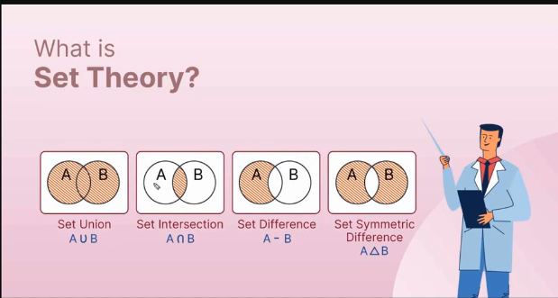

# Day-6 🚀

# Agenda

- Equi,Natural, Inner Join
- Subqueries
    - Exists
    - Not Exists
- Union, Intersect, Except
- `LIMIT` & `OFFSET`
- Types of Keys
- **ACID** Principle
- Group By and Order By (Advanced)

## Natural Join

Natural Join is a type of Join in which the Join condition i.e., `ON` condition is not given.

It identifies the similarity itself and Joins it.

Also there is no difference between Natural Join and Inner Join as both gives the same results which is common data

`NOTE: Natural Join is not in MSSQL`

## Equi-Join

Equi-join is a special type of inner Join. In inner join the `ON`  condition can have all type of equality comparison operators `=, !=, >, <`.…

Whereas, In Equi Join we can only use the `=` operator in `ON` condition

In simple words, any Inner Join with `=` as the equality operator with `ON` condition is the Equi  Join

### Let’s look what actually is a Inner Join and Equi-Join

First let’s just create some tables and insert the values for the demonstration

```sql
CREATE TABLE Employees (
EmployeeID INT,
Name VARCHAR(50),
Salary DECIMAL(10,2),
DepartmentID INT
);

CREATE TABLE Departments (
DepartmentID INT,
DepartmentName VARCHAR(50),
MinSalary DECIMAL(10,2)
);

INSERT INTO Employees VALUES (1, 'John Doe', 50000, 101), (2, 'Jane Smith', 40000, 102);
INSERT INTO Departments VALUES (101, 'HR', 45000), (102, 'Marketing', 35000);

Select * from Employees

Select * from Departments
```

Now let’s perform `INNER JOIN`  on the above tables

```sql
SELECT Name, Salary, DepartmentName, MinSalary
FROM Employees
INNER JOIN Departments
ON Salary > MinSalary
```

Here, we used `>` operator to Join the tables

Let’s understand `EQUI JOIN` on the above tables

```sql
Select Name, Salary, DepartmentName, MinSalary
From Employees
Inner Join Departments
on Salary = MinSalary
```

Here we have only used `=` as the JOIN operator

### Declaring Variables is SQL

```sql
DECLARE @g TEXT = 'Good Morning'!
```

## Tasks

- **Task 4**
*Write a query to calculate the tenure of each employee in complete years as of today.*
    
    ```sql
    SELECT DATEDIFF(YEAR, [startdate],GETDATE()) AS Tenure_Years
    FROM [EmployeeData]
    ```
    
- **Task 5**
    
     *Calculate Annual Salary Increase
    Assume a yearly salary increase of 3% for each employee.
     Write a query to calculate their new salary rounded to the nearest whole number.*
    
    ```sql
    SELECT [EmployeeID],[FirstName],[LastName],[Salary],([Salary]*1.03) AS Annual_Increase
    FROM [EmployeeData]
    ```
    
- **Task 6**
    
    *Write a query to display the least 3 priced products in the products table on SQL Server (`LIMIT` doesn’t work)*
    
    ```sql
    SELECT *
    FROM orders
    Order by purch_amt desc
    OFFSET 0 ROWS
    FETCH NEXT 3 ROWS ONLY;
    ```
    
- **Task 6**
    
    *For the same above query, Format the Purch_date field from products table to display the dates like `(dd/mm/yyyy)` format*
    
    ```sql
    SELECT *, FORMAT(ord_date, 'dd MM yyyy')
    FROM orders
    Order by purch_amt desc
    OFFSET 0 ROWS
    FETCH NEXT 3 ROWS ONLY;
    ```
    
- **Task 7**
    
    *For the same above query, Format the Purch_date field from products table to display the dates like `(25 Apr 2019)` format*
    
    ```sql
    SELECT *, FORMAT(ord_date, 'dd MMM yyyy')
    FROM orders
    Order by purch_amt desc
    OFFSET 0 ROWS
    FETCH NEXT 3 ROWS ONLY;
    ```
    
- **Task 8**
    - Declare a variable to fetch the records dynamically
    - Syntax for Declaring SQL variable,
        
         `DECLARE @variable_name <Data type> = Value` 
        
        ```sql
        DECLARE @n INT = 1;
        SELECT *
        FROM orders
        Order by purch_amt desc
        OFFSET 0 ROWS
        FETCH NEXT @n ROWS ONLY;
        ```
        

## Set Theory in SQL



### SQL supported Set Operation

- `UNION`  displays all the records from the result sets on both the LHS and RHS
- `INTERSECTION`  dsiplays all the  records that are common in both the table
- `EXCEPT` displays all the records that are in table A, but not in table B. (Displaying table A, excluding common records)

Let’s create some tables for understanding SQL Set operations better.

```sql
CREATE TABLE Products (
    ProductID INT,
    ProductName VARCHAR(50),
    Category VARCHAR(50),
    InStock CHAR(3)
);

INSERT INTO Products (ProductID, ProductName, Category, InStock) VALUES
(1, 'Laptop', 'Electronics', 'Yes'),
(2, 'Smartphone', 'Electronics', 'No'),
(3, 'Coffee Maker', 'Appliances', 'Yes'),
(4, 'Blender', 'Appliances', 'Yes'),
(5, 'T-shirt', 'Apparel', 'No');

CREATE TABLE Orders (
    OrderID INT,
    ProductID INT,
    CustomerName VARCHAR(50),
    Quantity INT
);
 
INSERT INTO Orders (OrderID, ProductID, CustomerName, Quantity) VALUES
(100, 1, 'Alice', 1),
(101, 3, 'Bob', 2),
(102, 2, 'Charlie', 1),
(103, 4, 'Dana', 1),
(104, 3, 'Alice', 1);
```

### Union

- **Task 1**
    
    *List all the distinct products that are either in stock or have been ordered*
    
    ```sql
    --Step 1: Selecting all ProductID from Orders
    SELECT [ProductID] FROM [Orders]
    
    --Step 2: Selecting all ProductId from Porducts where Instock = "Yes"
    SELECT [ProductID] FROM [Products] WHERE [InStock] = 'Yes'
    
    --Step 3: Unioning the Both result sets to get all the ProductIds that are either in Stock or have been ordered
    SELECT [ProductID] FROM [Orders]
    UNION
    SELECT [ProductID] FROM [Products] WHERE [InStock] = 'Yes'
    
    SELECT *
    FROM [Products]
    WHERE [ProductID] IN (
    					SELECT [ProductID] FROM [Orders]
    					UNION
    					SELECT [ProductID] FROM [Products] WHERE [InStock] = 'Yes'
    )
    ```
    

- **Task 2**
    
    *Identify the products that are both in stock and Orders table*
    
    ```sql
    --Step 1: Selecting all ProductID from Orders
    SELECT [ProductID] FROM [Orders]
    
    --Step 2: Selecting all ProductId from Porducts where Instock = "Yes"
    SELECT [ProductID] FROM [Products] WHERE [InStock] = 'Yes'
    
    --Step 3: Intersecting the Both result sets to get all the ProductIds that are both inStock and have been ordered
    SELECT [ProductID] FROM [Orders]
    INTERSECT
    SELECT [ProductID] FROM [Products] WHERE [InStock] = 'Yes'
    
    --Step 4: Selecting all the product details from product table where product ID is equivalent to the above query's productID
    SELECT *
    FROM [Products]
    WHERE [ProductID] IN (
    			SELECT [ProductID] FROM [Orders]
    			INTERSECT
    			SELECT [ProductID] FROM [Products] WHERE [InStock] = 'Yes'
    )
    ```
    
- **Task 3**
    
    *Find the stock that are in stock but never been ordered.*
    
    ```sql
    --Step 1: Selecting all ProductID from Orders
    SELECT [ProductID] FROM [Orders]
    
    --Step 2: Selecting all ProductId from Porducts where Instock = "Yes"
    SELECT [ProductID] FROM [Products] WHERE [InStock] = 'Yes'
    
    --Step 3: Differencing the Both result sets to get all the ProductIds that are both inStock and have been ordered
    SELECT [ProductID] FROM [Orders]
    EXCEPT
    SELECT [ProductID] FROM [Products] WHERE [InStock] = 'Yes'
    
    --Step 4: Selecting all the product details from product table where product ID is equivalent to the above query's productID
    SELECT *
    FROM [Products]
    WHERE [ProductID] IN (
    			SELECT [ProductID] FROM [Orders]
    			EXCEPT
    			SELECT [ProductID] FROM [Products] WHERE [InStock] = 'Yes'
    )
    ```
    

# Keys in RDBMS


## Primary key

Primary keys as we know are helpful in uniquely identifying a record

## Canditate key

Canditate keys are a single key or a combination of keys that have the potential to become the Primary Key

## Alternate key

Alternate keys are the fields that have the potential to become the primary key

`{Alternate Keys},{Primary Key} -> {Canditate Keys}`

## Unique key

Unique keys are keys that can help to identify a record easily. It is similar to primary key. Additionally it can have only one `NULL` value

## Super key

Super keys are a super set of keys which contains one or more keys that helps to identify a record uniquely


## Foreign key

Foreign keys are used to refer to data from other tables. They’re employed for maintaining referential identity.

# ACID Properties 🧪

### **A - Atomicity**

Let’s cosider a scenario where two guys Manoj and Mohammed trying to do a internet banking. Initially the bank balance of Manoj and Mohammed are Rs.300 and Rs.500 respectively. Both of them are having accounts different banks. Now, Mohammed proceeds to send a sum of Rs.200 to Manoj. On clicking the pay button, the amount is debited from Mohammed’s bank account and his bank server changed Mohammed’s bank balance from Rs.500 to Rs.200.  But, at that time Manoj’s bank server was offline and cannot recieve the account. Now this arises a potential concern for incorrect data on either of the banks databases. 

To overcome this, we must make sure that, either all of the operation completes in a single go, or none of them is happening. This principle is otherwise called “All or Nothing”

Also, make note that transactions are the things that is employed to overcome the issues related to atomicity in databases

### **C  - Consistency**

Let’s consider another scenario where Manoj is about withdraw some amount for purchasing gifts for his girlfriend. He goes to the ATM swipes his card and the ATM says, “Sorry, Your Bank’s server is busy”. This happens usually to everyone right!.What if instead of displaying this error if the ATM allowed Manoj to withdraw a Sum of Rs.1000? As the money is still there in the ATM machine, and Manoj’s bank account has the required balance to make withdrawal, it allows him to withdraw the money.

Now, Manoj notices that the amount is withdrawn with his card, but no money is debited from his account. He realises that  the bank server is offline and whatever the money that I’m withdrawing from ATM is not going to be reflected in his bank account as long as it is offline.

To eliminate this kind of scenarios from happening we need to make sure that, the data is consistent across all databases.

### **I - Isolation**

Now, coming to our friend Mohammed, he has three Debit cards for his account. He shared two of them to his two lovely girlfriends. Flipkart is making a online sale festival and both of his girlfriends are interested to buy that fancy necklace that they have been for so long on their wishlist. The necklace costs Rs.800. Our friend, Mohammed has Rs.1200 in his account.

Now both of his girlfriends are clicking the buy button and making the payment at the same micro-second. We know practically, only one of his girlfriend is going to buy the neckace and the other is going to broke up with him for his below-normal bank balance.

But Imagine, at time of clicking pay button, since both of them are doing this in the same microsecond, the database proceeds to make the payments parallely. 

For the girlfriend-1 the pay button worked and Rs.800 is debited from Mohammed’s initial balance Rs. 1200 and the database is updated to show a minimum balance of Rs.400

For the girlfriend-2 the pay button also worked and Rs.800 is debited from Mohammed’s initial balance Rs.1200 and the database is updated to show a minimum balance of Rs.400

You might wonder how is this even possible. Because both of them clicking pay button at the same time, both will be getting the same values for the bank balance. This is introducing a data integrity breach which in our case cannot be afforded.

To overcome this, we need to ensure each transaction takes place in isolation independent of one another.

### **D - Durability**

As the name suggests we need to make databases durable. But how to make it durable? To protect it from fire, short-circuit and wear-and-tear? No. Durability means the state of the database is maintained stable amidst all the chaos.

# Group-By & Order-By (ADVANCED)

Let’s understand Advanced Group-By and Order-by using SQL Server

First let’s create some tables.

```sql
CREATE TABLE EmployeeSales (
    EmployeeID  INT,
    Region      VARCHAR(50),
    Category    VARCHAR(50),
    Quarter     VARCHAR(10),
    SalesAmount DECIMAL(10,2)
);
 
INSERT INTO EmployeeSales (EmployeeID, Region, Category, Quarter, SalesAmount)
VALUES
    (101, 'North', 'Electronics', 'Q1', 1200.00),
    (101, 'North', 'Electronics', 'Q2', 1500.00),
    (102, 'North', 'Clothing', 'Q1', 800.00),
    (102, 'North', 'Clothing', 'Q2', 950.00),
    (103, 'South', 'Electronics', 'Q1', 1000.00),
    (103, 'South', 'Clothing', 'Q1', 1200.00),
    (104, 'East', 'Electronics', 'Q2', 1150.00),
    (104, 'East', 'Clothing', 'Q2', 500.00),sa
    (105, 'West', 'Electronics', 'Q1', 1900.00),
    (105, 'West', 'Clothing', 'Q1', 1100.00),
    (105, 'West', 'Electronics', 'Q2', 2100.00),
    (105, 'West', 'Clothing', 'Q2', 1300.00);
```

### Compound `ORDER BY`

We can use compounded `ORDER BY` ’s for more than one leveel of sorting.

Consider the above table and we want to sort and display it as region in a increasing order, and their sales amount in decreasing order

```sql
SELECT  *
FROM    [EmployeeSales]
ORDER BY [Region],[SalesAmount] DESC
```

## Compound `GROUP BY`

Similarly we can also use `GROUP BY` in a compounded manner to group records into more than one level of grouping

For example, lets say we want to group the records from above table based on region. Then, for each group we need to apply another grouping to group them based on the category. We can achieve this by,

```sql
SELECT  [Region],
        [category], 
        SUM([SalesAmount]) AS YTD_Sales
FROM    [EmployeeSales]
GROUP BY [Region],[Category]
```

These are some other examples of Basic Group By

```sql
SELECT  [Region], 
        SUM([SalesAmount]) AS YTD_Sales
FROM    [EmployeeSales]
GROUP BY [Region]

SELECT  [category], 
        SUM([SalesAmount]) AS YTD_Sales
FROM    [EmployeeSales]
GROUP BY [Category]

SELECT  [Region],
        [Quarter], 
        SUM([SalesAmount]) AS YTD_Sales
FROM    [EmployeeSales]
GROUP BY [Region],[Quarter]
```

## Grouping Sets

We can see that in the last example we were doing three different grouping operation one after another.

Let’s say we need all the above grouping result in a single query. Ofcourse we can use `UNION` to unite all the results of the above queries. What if, there’s a way to do it all in one go.That is where `GROUPING SETS()` comes into picture. 

```sql
SELECT  [REGION], 
        [CATEGORY] , 
        [QUARTER] ,
        SUM([SALESAMOUNT]) 
FROM    [EmployeeSales]
GROUP BY GROUPING SETS(
  ([REGION], [CATEGORY]),
  ([REGION] , [QUARTER]),
  ([REGION]),
  ([CATEGORY])
)
```

This as a single query potentially did everything that those three queries are doing indvidually. We just improved our query performance.

But if you see the result we get all the required results in a tangles manner

What we can do is, we can `ORDER` them as follows.

```sql
SELECT  [REGION], 
        [CATEGORY] , 
        [QUARTER] ,
        SUM([SALESAMOUNT]) 
FROM    [EmployeeSales]
GROUP BY GROUPING SETS(
  ([REGION], [CATEGORY]),
  ([REGION] , [QUARTER]),
  ([REGION]),
  ([CATEGORY])
)
ORDER BY GROUPING([REGION]), GROUPING([CATEGORY]), GROUPING([QUARTER)
```

## Co-related Sub-queries

Whenever we write a nested sub-query remember that the data  from outer sub-query can be utilised by the inner sub-query. In this way, they are co-related to each other.

Thus, they are called as co-related sub-queries

```sql
SELECT  [name],
        [commission],
        [city]
FROM    [salesman] s1
WHERE   [commission] = (
	SELECT  MAX([commission])
	FROM    [salesman] s2
	WHERE   s1.city = s2.city
)
```