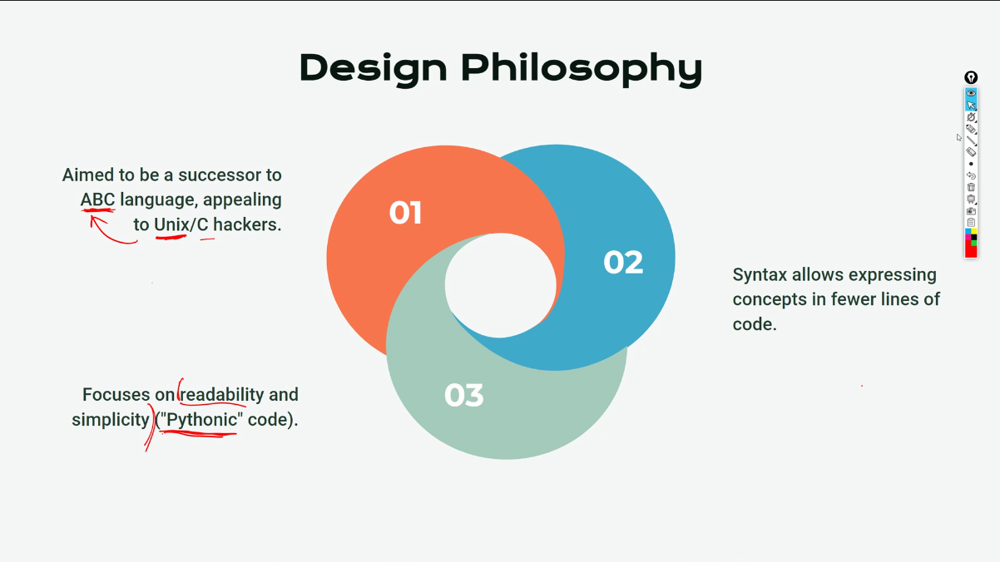

# Day-8 🚀

# Python Day-1 📆

## Introduction to Python

- High-level, interpreted, general-purpose programming language.
- Created by Guido Van Rossum, first released in 1991.
- Emphasizes code readability with significant indentation.

Some of the new programming languages are

- Rust
- Swift
- Kotlin

## Python Design Philosophy



## Major Milestones

1. Python 2.0(2000): Introduced list comprehension, Garbage collection
2. Python 3.0(2008): Major revision. not-fully backwards compatible. emphasized unicode support


## Popularity and Usecases

Package Index (PyPI): Python has over 200,000 packages

Extensive standard and third-party library

Frameworks: Django, Flask, Pyramid

Scientific Stack: NumPy, SciPy, Pandas, Matplotlib


## Variable Naming  conventions

1. Variable names cannot start with  `@ , . $ etc`  except `_` underscore

# Tasks on User inputs and type conversions

**Task 1: Convert Fahrenheit to celsius**

```python
fahrenheit = float(input("Enter temperature in fahrenheit: "))
celsius = (fahrenheit - 32) * 5/9
print('The equivalent of ' + str(fahrenheit) + '°F is ' + str(celsius) + '°C')
```

**Task 2: Calculate age with birth year**

```python
birth_year = int(input("Enter your birth year: "))
age = 2024-birth_year
print('Your age is ' + str(age))
```

**Task 3: Print the area of the circle**

```python
radius = int(input('Enter the radius: '))
area =  (22/7)*(radius**2)
print(f'The area of the circle is {area}')
```

### f’Strings’ in Python

In the above code snippet, we can see that the fahrenheit, celsius, bith_year and age has to be converted to `str` before concatenation. This means, we can only concatenate strings with strings but not with any other datatypes.

Instead, we can use `f'string'` to display the string in a single go. here’s how to do it. Additionally we can use not only variables but also expressions inside `f'string'`

```python
f'The expression 1 {expression1} and expression 2{expression2}'
```

So, that we know the f’strings’ now, we can make use of it by replacing previous tasks print statement’s string concatenation with  `f'string'` . 

For the fahrenheit task,

```python
print(f'The equivalent of {Fahreheit} °F is {Celsius}°C')
```

For the age task

```python
print(f'Your age is {age}')
```

### How to execute python from the terminal

`Note: Environment variables had to be set` 

Step 1: Open terminal (cmd, powershell, bash)

Step 2: Make sure you’re in the project directory. If not, go to the project directory (where your python file is stored) using the following command.

```bash
cd "YOUR-PROJECT-DIRECTORY"
```

Step 3: Once you’re in the current directory you can execute the python file by using this command.

```bash
python filename.py
```

That’s it. It works!

## Conditional Statements in Python

Conditional statements are the code lines that alter the flow of control of program to particular statement(s).

These conditional statements makes use of relational operator for generating boolean values.

Keep in note, unlike other programming languages python is indent based. So make sure to  give proper indentation.

**Task 1: Evaluating who is taller between two people using condtional statement.**

```python
name1,name2 = input(f'What is first guy\'s name? '),input(f'What is second guy\'s name? ')
height1,height2 = int(input(f'What is {name1}\'s height?  ')),int(input(f'what is {name2}\'s height? '))
if height1 > height2:
  print(f'{name1} is taller than {name2}')
elif(height2>height1):
  print(f'{name2} is taller than {name1}')
else:
  print(f'Both are of same heights')
```

**Task 2: The following are some ice-cream flavors in stock**

- **Vanilla**
- **Lime**
- **Chocolate**

**You need to ask the user for their favourtie flavor and print whether it is in stock.**

This can be done using if elifs.

```python
stock1 = 'vanilla'
stock2 = 'lime'
stock3 = 'chocolate'

favFlavour = input('Enter your favourite flavour:')
if(favFlavour == stock1):
  print('Yes we do have it')
elif(favFlavour == stock2):
  print('Yes we do have it')
elif(favFlavour == stock3):
  print('Yes we do have it')
else:
  print('No, we ran out of stock')
```

This above can be optimised even further with combining all `if,elif` blocks using `or` operator

```python
stock1 = 'vanilla'
stock2 = 'lime'
stock3 = 'chocolate'

favFlavour = input('Enter your favourite flavour:')
if((favFlavour == stock1) or (favFlavour == stock2) or (favFlavour==stock3)):
  print('Yes we do have it')
else:
  print('No, we ran out of stock')
```

Even further, what we can do is, we can put all the stocks in a single string and search for the user flavor substring in the whole stock string

```python
shop_stock = "vanilla, lime, chcoclate"
favFlavour = input('Enter your favourite flavour:')
if(favFlavour in shop_stock):
  print('Yes we do have it')
else:
  print('No, we ran out of stock')
```

## Ternary Operator

As you can see in the above snippet, the if else block contains two block. Which means it can be optimised to ternary operator even further

```python
stock1 = 'vanilla'
stock2 = 'lime'
stock3 = 'chocolate'

favFlavour = input('Enter your favourite flavour:')
Output = 'Yes we do have it' if (favFlavor in stock) else 'No, we ran out of stock'
print(Output)
```

Do you know? Why is it called ‘Ternary Operator’. The term ternary denotes three. As the syntax  of ternary operator has three terms, `statement1, condition, statement2` it  is known as ternary operator

# 5 Pillars of Code Quality

1. Readability
2. Maintainability
3. Extendability
4. Testability
5. Peformance

## String methods

| Method | Description |
| --- | --- |
| upper( ) | turns all the string characters into upper case |
| lower( ) | turns all the string characters into upper case |
| captitalize( ) | Capitalaize the first letter of first word in any sentence |
| title( ) | turns first letter of all the words of a sentence capitalized. |
| strip( ) | strips the leading or trailing whitespaces.. (If a character is given as argumennt, then it strips leading or trailing occurences of that particular character  |
| lstrip( ) | similar to strip but works only on the leading whitespaces |
| rstrip( ) | similar to strip but works only on the trailing whitespaces |
| find(x) | returns the starting index where  it finds the substring ‘x’ in the given string. the substring can be a character, word etc., |
| replace(a,b) | it finds and replaces all the occurences of ‘a’ with ‘b’ in a given string |

Remember the string methods specified above, ***always returns a new string*** with the specified modification. It never tries to modifies the original string, because ***strings are immutable in python*** 

## Creating Python Virtual Environment

```bash
python -m venv myenv 
\myenv\Scripts\Activate.ps1
```